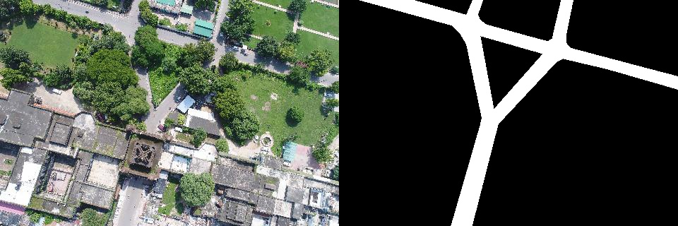
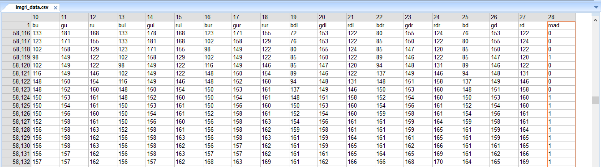
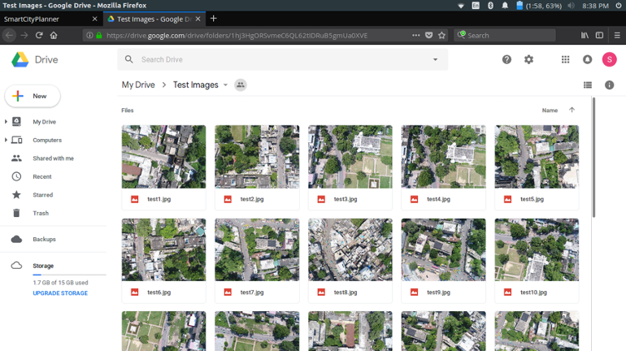
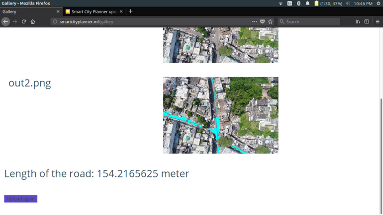
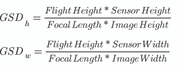

# Road Network Mapping from Aerial Images

This is the implementation of SPIE 2019 paper ["Road Network Mapping from Aerial Images"](https://doi.org/10.1117/12.2529005) created by 
<a href="https://github.com/suchitj2702" target="_blank">Suchit Jain</a>, <a href="https://github.com/rohanmittal73" target="_blank">Rohan Mittal</a>, <a href="https://prakamya-mishra.github.io/" target="_blank">Prakamya Mishra</a>, <a href="https://twitter.com/AakashSinhaRobo" target="_blank">Aakash Sinnha</a>.

> Building and expansion of an efficient transportation network are essential for urban city advancement. However, tracking road development in an area is not an easy task as city planners do not always have access to credible information. A road network mapping framework is proposed which uses a random forest model for pixel-wise road segmentation. Road detection is followed by computer vision post-processing steps including Connected Component Analysis (CCA) and Hough Lines method for network extraction from high-resolution aerial images. The custom dataset used consists of images collected from an urban settlement in India.

## The Dataset
* The dataset used were a set of 1000 images collected from drones, over various types of Indian settlements.
* Ground Truth was made by masking another blank layer onto the original image and marking each pixel which represented road.

  
* A CSV file with 28 features of each pixel was made for each image. The features being RGB values of the pixel itself along with each of the adjacent pixel. The last column being either 0 or 1 representing road pixel or non-road pixel.

  
* The CSV of 170 such images were combined to form one huge CSV as the training set.

## Machine Learning
* The application uses Random Forest algorithm to detect roads.
* Each pixel of the image goes through a pre-trained Random Forest perceptron, which predicts if the pixel belongs to the road class or the non-road class.
* Connected Component Analysis(CCA) is used to make clusters of
* Though slower than most deep learning techniques, this technique turned out to be much more accurate in the results.

The goal of this project is to develop a dynamic web application which will ease the process of city planning and development-tracking for the user with minimum effort spent by the user in repetitive processes. With the widespread development in the field of Artificial Intelligence, the aim here is to at least being able to reduce the repetitive processes such as spotting different features in an image to only a computational challenge.

This repository reflects a solution to road detection and road length calculation in images taken from a drone.

## The Application
* On the landing page the user can either upload his/her own images or to test the application the user can use the example test images provided

  

  
* Once uploaded it usually takes 3-5 minutes to process depending on the size of the image

  
* Once done processing the user can view the results by clicking the "View Results" button

  
* The result shows the output image with roads clearly marked along with the length of the road detected

  
  
## Length calculation
* The Ground Sample Distance(GSD) for each image is first calculated by extracting the "relative_altitude", "focal_length","sensor_height" and "sensor_width" from exif data of the image and then using the below formula.

* GSD tells us that how much distance(in cm) does each pixel dimension signify. Since pixels are square, minimum of height GSD and width GSD is considered to be the final GSD.
* Connected Component Analysis(CCA) is used to make clusters of pixels where the road was detected. A huge cluster is usually divided into multiple clusters.
* Hough transform is used to fit a mean line to each of these clusters. The width of the line kept at one pixel.
* Now to finally to calculate the length, the GSD is finally multiplied with the total number of pixels forming the mean lines.
* For testing the accuracy of the length, comparisons were made with the length of roads found out from Google Maps for the same area. This was tested for a huge set of images.
* The length turns out to be accurate up to an average variance of 5 meters

## Citation

    @inproceedings{10.1117/12.2529005,
      author = {Suchit Jain and Rohan Mittal and Prakamya Mishra and Aakash Sinha},
      title = {{Road network mapping from aerial images}},
      volume = {11139},
      booktitle = {Applications of Machine Learning},
      editor = {Michael E. Zelinski and Tarek M. Taha and Jonathan Howe and Abdul A. S. Awwal and Khan M. Iftekharuddin},
      organization = {International Society for Optics and Photonics},
      publisher = {SPIE},
      pages = {321 -- 326},
      keywords = {Road Detection, Semantic Segmentation, Random Forest, Aerial Images, Computer Vision, Machine Learning, Hough lines, Connected Component Analysis},
      year = {2019},
      doi = {10.1117/12.2529005},
      URL = {https://doi.org/10.1117/12.2529005}
    }

## License

MIT License

## Todos

Please request in Github Issue for more code to release.
